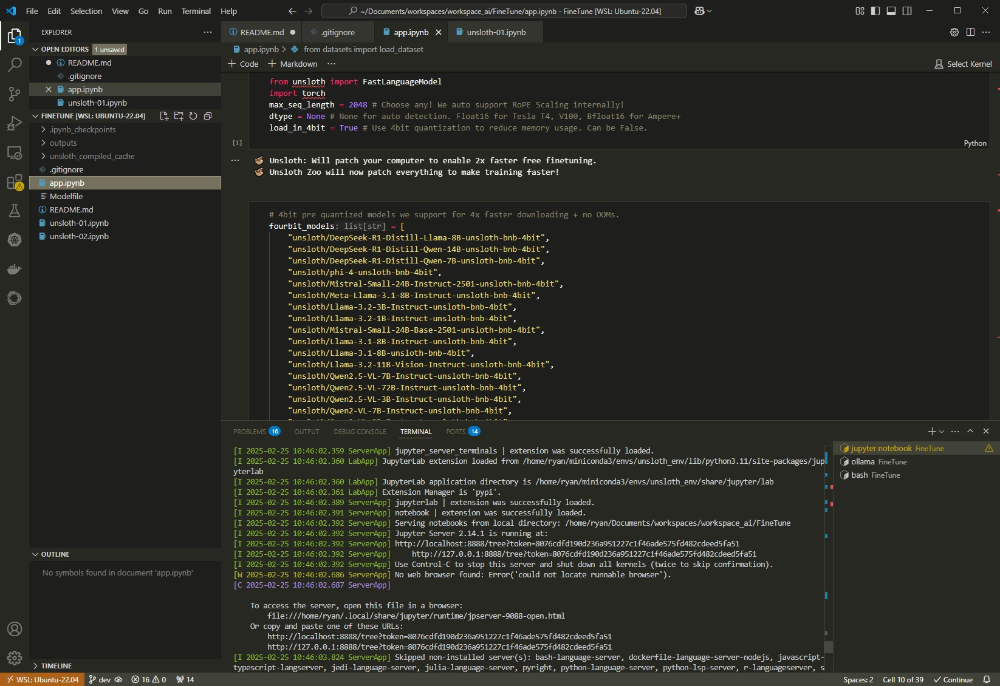

# FineTune
[Unsloth](https://github.com/unslothai/unsloth) makes finetuning large language models like Llama-3, Mistral, Phi-4 and Gemma 2x faster, use 70% less memory, and with no degradation in accuracy!

The code exercise will finetune the DeepSeek R1 with text-to-sql dataset.

## 1. Install `WSL` or `WSL2` on Windows
[How to install Linux on Windows with WSL](https://learn.microsoft.com/en-us/windows/wsl/install)

Setting up Ubuntu: Turn on Windows System for Linux from the features.

## 2. Install **Visual Studio Code** on Windows
[Visual Studio Code on Windows](https://code.visualstudio.com/docs/setup/windows)

Use it to access the Ubuntu Linux distro - WSL.


## 3. Install **Miniconda**    
### 3.1. **Miniconda** Installation:
Run on Terminal. Install miniconda in the user's home folder `~/`:
```shell
$	mkdir -p ~/miniconda3
$	wget https://repo.anaconda.com/miniconda/Miniconda3-latest-Linux-x86_64.sh -O ~/miniconda3/miniconda.sh
$	bash ~/miniconda3/miniconda.sh -b -u -p ~/miniconda3
$	rm -rf ~/miniconda3/miniconda.sh
$	~/miniconda3/bin/conda init bash
$	~/miniconda3/bin/conda init zsh
$ source ~/miniconda3/bin/activate
$ conda init --all
```

### 3.2. Virtual Environment
Next would be to set up a virtual environment.
    
Open a new Terminal: 

```shell
(base) $	conda create --name unsloth_env python=3.11.9 pytorch-cuda=12.1 pytorch=2.3.0 cudatoolkit xformers<0.0.27 -c pytorch -c nvidia -c xformers -y
(base) $	conda activate unsloth_env

(unsloth_env) $	pip install "unsloth[colab-new] @ git+https://github.com/unslothai/unsloth.git"
(unsloth_env) $	pip install --no-deps trl peft accelerate bitsandbytes
```

The `xformers` may give this warning:
```
WARNING[XFORMERS]: xFormers can't load C++/CUDA extensions. xFormers was built for:
    PyTorch 2.3.0+cu121 with CUDA 1201 (you have 2.5.1)
    Python  3.11.9 (you have 3.11.11)
  Please reinstall xformers (see https://github.com/facebookresearch/xformers#installing-xformers)
  Memory-efficient attention, SwiGLU, sparse and more won't be available.
  Set XFORMERS_MORE_DETAILS=1 for more details
```

Here is the remedy when creating the virtual environment:
```shell
$	conda create --name unsloth_env python=3.11.9 pytorch-cuda=12.1 pytorch=2.3.0 cudatoolkit -c pytorch -c nvidia -c xformers -y
```

### 3.3. Install `jupyter`
```shell
(unsloth_env) $ conda install jupyter
(unsloth_env) $ jupyter notebook
```

Open `app.ipynb` on `jupyter notebook:


### 3.4. Install **C Compiler** and its modules
Now, get the files ready, and train the model. While training, there will be another issue of C compiler not found. You solve this by running these two:
```shell
$	sudo apt update
$	sudo apt install build-essential
```

### 3.5 Generating a model:
*	Next would be to save the models as safe tensors
*	Next would be save in the .gguf format
*	This would be used to make the ollama model

### 3.6 Install **Ollama**
Next, install the Ollama library
```shell
$ curl -fsSL https://ollama.com/install.sh | sh
```

Then create the Modelfile and run the ollama command to create the model using the Modelfile.
